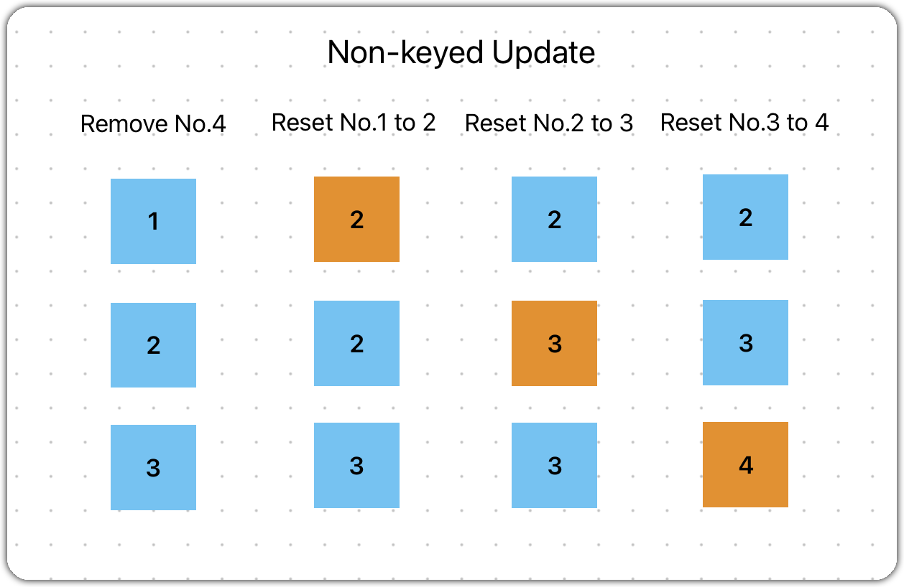

大多数现代框架已经引入了它们自定义的方法或语法来处理循环，就像它们在条件渲染中所做的那样。让我们也来看看组件库中提供的不同框架示例：

```js [react]
return (
  <ul>
    {colors.map((color) => (
      <li key={color}>{color}</li>
    ))}
  </ul>
)
```

```html [vue]
<template>
  <ul>
    <li
      v-for="color in colors"
      :key="color"
    >
      {{ color }}
    </li>
  </ul>
</template>
```

```js [solid]
return (
  <ul>
    <For each={colors}>{(color) => <li>{color}</li>}</For>
  </ul>
)
```

```html [svelte]
<ul>
  {#each colors as color (color)}
    <li>{color}</li>
  {/each}
</ul>
```

虽然这些框架提供了它们独特的循环方式，但它们引入了额外的语法层，这有时可能会导致混淆，特别是对于在不同框架之间切换的开发人员。相比之下，DLight 保有了 JavaScript 的精华：

```js [dlight]
ui(); {
  for (const color of colors) {
    li(color)
  }
}
```

在 DLight 中，您能看到的是 JavaScript 的原始且令人熟悉的强大功能。

# 键控 vs. 非键控

键值更新使用每个循环项的唯一标识符（“键”）来追踪每个项的身份，以便在重新渲染时进行识别。当数据发生变化时，只有具体更改的项（根据唯一键）会被更新。

DLight 接受所有类型的键。默认情况下，循环里的项自身就是一个键（非键控）：

```js
for (const color of colors) {
  li(color)
}
// -> key = color
```

您可以通过在 `for` 循环体后面添加一个包含您的键的长度为 1 的数组来设置自己的特定键：

```js
for (const [idx, color] of Object.entries(colors)) { 
  [myId]
  li(color)
}
// -> key = idx
```

与 React 不同，DLight 中非键控循环总是比键控循环快。以下是一个简单的示例，解释了为什么会这样。

假设我们有四个显示数字 `1, 2, 3, 4` 的元素，我们希望移除数字 1。

- 对于键控更新，首先需要移除数字 1 并将其他三个元素向上移动。在这种情况下，我们需要计算已移除元素的索引，并将其从其父节点中移除。（keyed 使用 shuffle 算法）
  
- 对于非键控更新，它只会删除最后一个元素，并相应地更改前面的元素。在实现中，我们不需要找到要移除的元素的索引。我们在这里要做的是获取新数组的长度（3），并在旧数组中进行切割（1,3,4），然后进行一些元素属性的修改操作，这样的操作成本要低得多。
  

如果没有特定的要求设置键，非键控更新适用于 90% 的情况。这是我们在 DLight 中如何实现的：

```js
for (const color of colors) { 
  [null]
  li(color)
} 
// -> non-keyed loop
```
