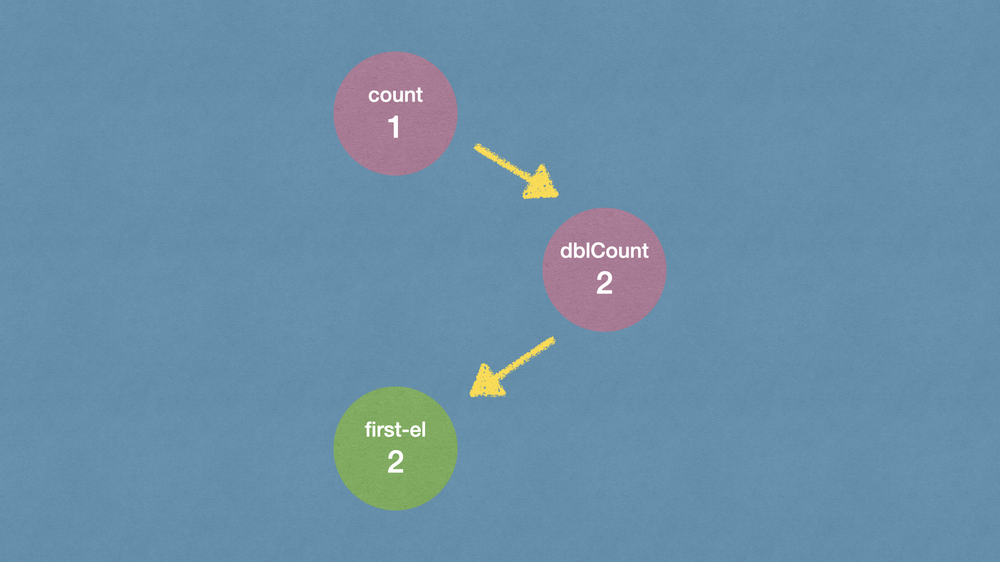
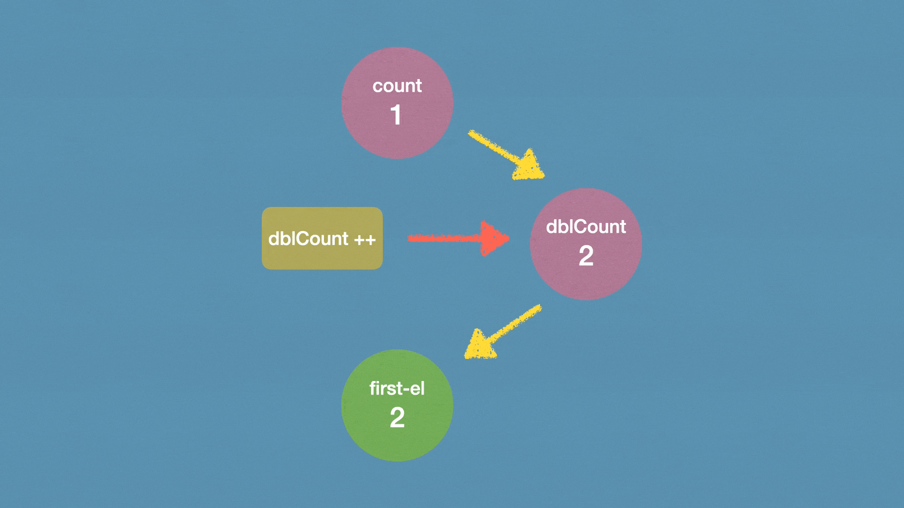
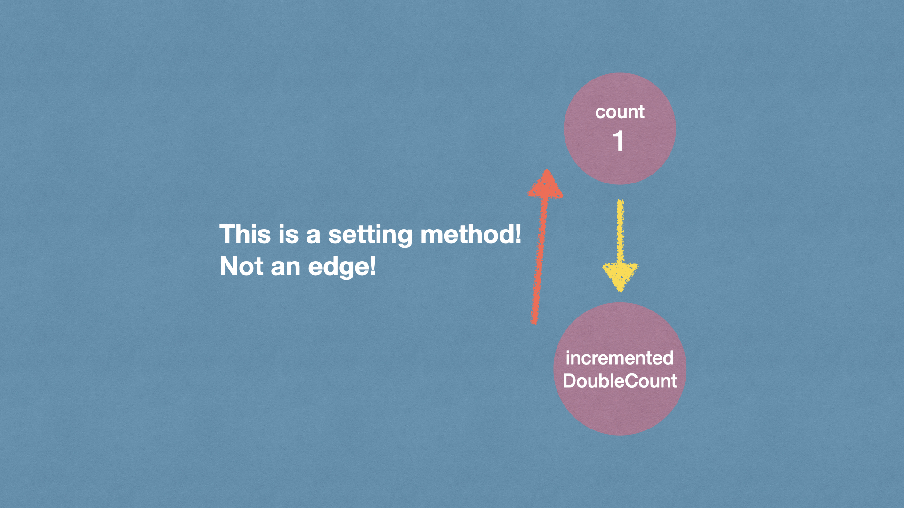

深入探索Reactivity Graph

# 介绍
Reactivity，也就是在数据变化时更新UI的能力，在现代前端框架中是至关重要的。随着前端应用越来越复杂，可变状态的管理及其对UI的影响变得尤为重要。虽然前端社区为Reactivity设计了各种解决方案，但仍然存在一些常见的问题和挑战：

* 更新不一致：数据变化与UI更新之间的不一致性可能导致问题。
* 过度渲染：无法精确判断哪些UI部分需要重新渲染，可能会导致不必要的计算和DOM操作。
* 依赖管理挑战：在大型应用中，理解和管理各种状态之间的依赖关系变得复杂。
* 调试困难：没有清晰的数据流和更新逻辑，故障排查可能会变得特别耗时。

# Reactivity Graph的概念
当我们思考这些问题时，我们能发现一些规律吗？这些更新、依赖和数据的流动是不是可以构成一个图(graph)？其中，数据状态是节点，而它们的依赖关系则是边，形成了一个网络，只要数据发生变化，就会触发UI的更新。

这就引出了我们今天要深入探讨的主题——“Reactivity Graph”。Reactivity Graph是一个有向的无环图，在这个模型中：
* 节点：代表了一个可以观察和更改的状态。
* 边：表示状态之间的依赖关系。
* 方向：指定数据变化的传播路径。

在这个模型里，每次状态发生变化都会顺着其依赖（也就是边）的方向传播，确保应用中受到影响的部分得到准确的更新，并避免了不必要的渲染和计算。

尽管Reactivity Graph的概念在过去的许多年里已经在多个领域被探索和应用，但其在前端框架中的应用和系统化实现尚待完善。这为我们提供了一个机会，去进一步探索和适配这个强大的模型，来解决现代网络开发中关于reactivity和数据流动的问题。

# 构建Reactivity Graph
## 基础的计数示例
考虑一个简单的应用状态，其中我们有`count`，`doubleCount`（其值总是`count`的两倍），以及一个UI元素`first-el`，用来显示count的值。

在我们可视化我们的Reactivity Graph之前，让我们先通过代码来展示我们的示例。请注意，以下的语法并不特定于任何框架，只是以一种易于理解的方式来传达这个思想。

```js
let count = declareState(1);
let doubleCount = declareState(count * 2);
const el1 = document.createElement("div");
el1.id = "first-el";
el1.innerText = declareState(count)
```
分解：
* `declareState(1)`: 声明了一个初始值为1的响应式状态count。
* `declareState(count * 2)`: 声明了一个响应式的派生状态doubleCount，其值是count的两倍。
* `declareState(count)`: 绑定el元素的内部文本，使其显示count的当前值。

现在，让我们将其转化为一个简单的reactivity graph：


在这张图中，节点 (`count`, `doubleCount`, 和 `div: first-el`) 代表我们的状态和UI元素，而边代表它们之间的依赖关系，即：
1. 当 `count` 发生变化时, `doubleCount` 重新计算 **一次** 
2. 当 `count` 发生变化时, `first-el` 重新渲染innerText **一次**

将它们放入一个表格中：

| state | target |
| --- | --- |
| count | doubleCount |
|       | first-el |

可视化是这样的：


## 增加一层复杂性
让我们修改我们的示例，使`first-el`显示`doubleCount`而不是`count`。我们还需要对JavaScript伪代码进行一些小的修改来反映这一点：
```jsx
let count = declareState(1);
let doubleCount = declareState(count * 2);
let el1 = document.createElement("div");
el1.id = "first-el";
el1.innerText = declareState(doubleCount)
```
Reactivity图是这样的:



这是我们新图中的Reactivity流的示意图：
1. 当 `count` 发生变化时, `doubleCount` 重新计算 **一次** 
2. 当 `doubleCount` 发生变化时, `first-el` 重新渲染innerText **一次**

这是表格版本：
| state | target |
| --- | --- |
| count | doubleCount |
| doubleCount | first-el |

动画版本：


这里值得讨论的一个重要点是，直接修改派生状态，如我们示例中的`doubleCount`。


根据传统的逻辑，直接修改`doubleCount`可能不会被视为一个操作，因为它计算上是绑定到`count`的（具体是`count` * 2）。但是，让我们转变一下思维：为什么`doubleCount`应该是不可变的？毕竟，它是一个变量，而变量本质上是可变的。所以我更愿意将这类变量称为`derived state`而非`computed state`。

假设我们直接改变`doubleCount`，如`doubleCount ++`。在支持派生状态可变的Reactivity graph中：
1. `doubleCount`增加1，因此，它的新值是3。
2. `doubleCount`的变化触发了`first-el`的重新渲染，更新其显示的值为3。

在这个模型下，任何后续的对`count`的修改都会再次重新计算`doubleCount`，并引发`first-el`的重新渲染。所以如果我们`count++`：

1. `count`增加1，其新值变为2。
2. `doubleCount`重新计算，根据其定义的逻辑`count * 2`，更新其值为4。
3. `doubleCount`的变化促使`first-el`重新渲染，显示新的值，4。



## 小节总结及更多复杂性
在上一部分中，我们构建了一些简单的reactivity graph，了解了如何使用这个模型来可视化和管理各种状态及其依赖关系。从简单到复杂的依赖关系，reactivity graph直观地展示了它描绘和指导应用程序中的状态管理和数据流的能力。

现在，让我们来看一个更复杂的例子，其中包含多个状态和依赖关系，并置于数学逻辑操作的背景下。

想象一下，我们有四个状态：a、b、c、d：

* a: 基础状态，初始值为1
* b: 依赖于`a`，表示为 `a * 2`
* c: 依赖于`b`，表示为`b + 1`
* d: 依赖于`b`和`c`，表示为`b * c`

以及两个元素：
* el1 => 展示 `a + b`
* el2 => 展示 `d`

现在我们可以得到reactivity graph:


# 将Reactivity Graph融合到前端
将Reactivity Graph应用到前端开发中会引入多种场景，这可能需要对图表进行特定的处理或修改，以确保流畅和高效的Reactivity管理。

我们之前提到过与Reactivity Graph相关的四个前端问题，它们是：
* 更新不一致
* 过度渲染
* 依赖管理挑战
* 调试困难

在本节中，我们将深入探讨如何策略性地使用Reactivity Graph模型，以应对复杂的前端场景并提供最佳的用户体验。

## 更新不一致
更新不一致是指用户界面(UI)没有准确得反映当前的应用状态，导致差异，并可能导致显示或处理的数据不正确。

通过遵循reactivity graph的流程，执行变得稳定，保持UI更新的一致性。

大部分更新场景是有“副作用”的情况。在当前的前端框架中，开发者经常与“副作用”作斗争，这是指影响或受到其局部环境之外状态影响的操作。这可能包括数据获取、订阅或手动的操作DOM。本质上，它们不仅从现有值中派生新数据，而且可能会发起改变而间接影响系统其他部分。副作用概念的引入经常会复杂化数据流，导致令人担忧的更新不一致问题，即UI没有准确地显示当前的应用状态。

相比之下，reactivity graph直接消除了副作用的概念，采用了以下结构： 
* 每个操作、状态或视图都被封装为一个节点。
* 所有的影响和依赖关系都被描述为边。

让我们用一个具体的例子来说明这一点，以便提供更好的理解。

在传统的前端框架中，开发者可能会使用副作用，比如，每当一个变量发生变化时，都将其当前状态输出到控制台。请注意，以下语法并不特定于任何框架，而是为了以一种易于理解的方式传达这个想法。

```js
const [count, setCount] = state(0)

effect(() => {
  console.log(count);
}, [count])
```
在这种情况下，effect 作为一个副作用方法，它监听 count 的变化，并且每当 count 改变时，都会运行一段代码（输出到控制台）。

在reactivity graph中执行此操作时，传统上副作用被转化为图结构中的一个依赖节点。让我们用伪代码方法进一步说明这一点：
```js
let count = declareState(1)
let logCount = declareState((() => {
    console.log(count);
    return null; // This value can be anything, as the main purpose is the execution of the IIFE.
})());
```
说明:
* `declareState(1)`: 声明一个初始值为1的响应性状态 count。
* `declareState((() => { console.log(count); return null;)());`: 这不是一个传统意义上的“副作用”。相反，它建立了另一个状态。但是，因为它是一个立即调用的函数表达式（IIFE），所以它在声明期间立即执行console操作。这里的`console.log(count)`，类似于一个“副作用”，是在返回一个值并确定状态之前执行的。然而，在Reactivity Graph的上下文中，这并不被视为一个“副作用”，而仅仅是在其创建过程中执行了操作的一个状态。

在Reactivity Graph中，它可以被可视化为：


在Reactivity Graph中，一切状态包括传统框架中被视为副作用的，都被视为节点。这意味着没有明确的“效果”或“副作用”的概念；每个节点都有平等的地位，行为基于它们与其他节点形成的关系（边）。 这种设计选择简化了依赖管理，由于每个操作都是明确的并包含在节点内，数据流有了清晰性，减少了不一致的可能性。

## 过度渲染
过度渲染是前端开发中最常见的性能问题之一。当UI在没有实际更改它们所代表的数据的情况下被重新渲染时，会导致不必要的计算开销。

Reactivity Graph，凭借其对节点（状态和视图）和边（依赖性）的明确描述，为防止过度渲染提供了强大的对策。以下是具体方法：
1. 明确的依赖管理：每个节点的依赖都被边清晰地标记，可以清晰地了解哪些数据影响UI的哪一部分。这一结构确保当特定的数据节点发生变化时，只有受影响的UI会被重新渲染。
2. 优化传播：基于图模型的一种高效的遍历方法。当一个节点更新时，只有与它的直接和间接依赖的会被重新计算，避免了任何无关的计算。
3. 对属性精细地控制：开发者可以通过将视图的特定属性指定为单个节点来实现更精细的控制。这样做，只有这些属性得到更新，无需重新渲染整个元素。这种粒度避免了资源浪费，并显著提高了性能。

## 依赖管理挑战
当存在直接或间接的自我引用导致反应性状态或操作无休止地触发自身时，就会出现循环依赖。这种依赖关系可能导致无限循环，使应用程序无响应或产生意外的结果。

在典型的reactivity系统中，这可能会导致严重的问题。然而，Reactivity Graph具备更有效地检测和处理这些情况的能力。

伪代码示例：
```js
let count = declareState(2 / reverseDouble);
let incrementedDoubleCount = declareState((() => {
  count ++
  return count * 2
})());
```
在这种情况下：
* `incrementedDoubleCount` 执行了增加`count`的操作，并返回其一倍的值。
* 当计算`incrementedDoubleCount`时，它更改了`count`，进而又更改了 incrementedDoubleCount 本身，再次影响了`count`的值，这导致了一个循环依赖。

Reactivity Graph应对循环依赖的处理方法描述如下：
1. 识别循环点：Reactivity Graph通过定位包含 getter（依赖）和 setter（分配）方法的状态节点来识别潜在的循环点。
2. 划分 AssignDeps：一旦检测到循环点，状态中的所有 setter 方法都被隔离并分类为 assignDeps。
3. 过滤依赖：下一步过滤节点的依赖。节点更新后的依赖集（deps）变为：
```text
resolvedDeps = { x | x ∈ deps & x ∉ assignDeps }
```
通过使用这个公式，响应系统确保了所有 setter 方法的依赖（可能引入循环）都从状态的响应依赖中移除。

我们可以用下图来说明这种方法：



值得注意的是，loop dependencies与circular dependencies不同。circular dependencies意味着 A 依赖于 B，而 B 同时依赖于 A，这种情况永远不会发生，因为：
1. 从设计上讲，Reactivity Graph是一个有向无环图（DAG），这意味着它本质上没有循环。
2. 在 JavaScript 中，变量必须在被引用之前声明。

通过使用上述步骤，Reactivity Graph确保循环依赖得到有效处理，防止无限循环以确保应用程序平稳运行。

## 调试困难
调试是软件开发的关键环节，在复杂的Reactivity系统中，它可能特别具有挑战性。经常面临的主要障碍之一是数据流的不透明，使得难以准确找出哪里可能出了问题。

然而，Reactivity Graph为这个难题提供了解决方案。其清晰的基于节点的结构允许显式地查看整个状态流。有了这种显式结构，开发者可以轻松地追踪任何不一致或意外行为的源头。

从本质上说，Reactivity Graph通过提供连贯且清晰的状态互动和依赖关系的概览来简化调试。因此，开发者可以迅速地识别并解决问题，确保应用的顺畅运行。

# 总结
在本文中，我们深入探讨了“Reactivity Graph”的概念，并展示了它如何用于解决前端应用中的reactivity问题。

要点:
* Reactivity Graph的概念：Reactivity Graph是一个有向无环图，其中节点代表可观察和可变的状态，边代表状态之间的依赖关系。通过这种方式，任何数据的变化都可以准确地传播，从而实现高效的UI更新。
* 前端开发中的挑战：我们列出了前端开发中面临的四个主要的关于reactivity的挑战 - 更新不一致、过度渲染、依赖管理挑战和调试困难。Reactivity Graph提供了一种结构化的方法来解决这些问题。

总之，Reactivity Graph为前端开发者提供了一个强大的工具，能更有效地管理应用状态和UI变化。通过这种方法，开发者可以构建更加稳定、高效和可维护的应用。随着前端技术的不断发展，我们期待看到更多的创新和优化，使reactivity管理变得更简单高效。
